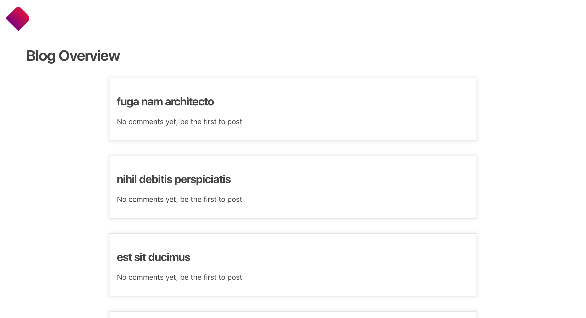
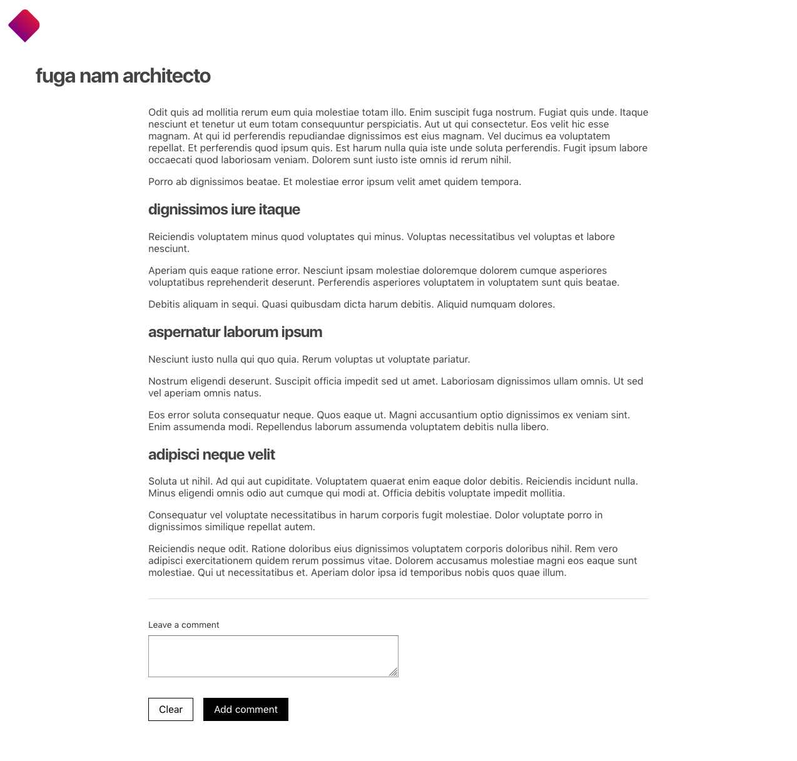
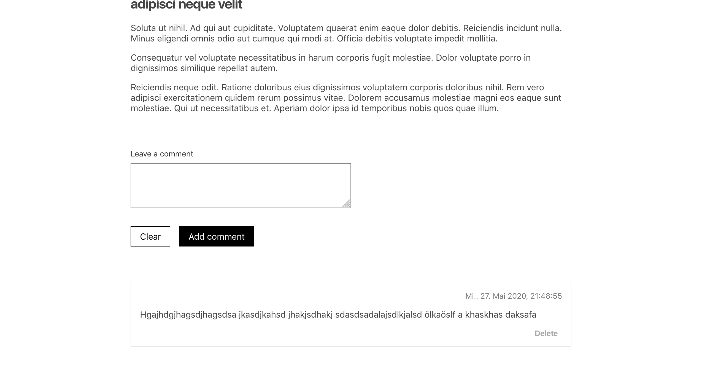

# Blog comments

Use the data.json file to display a list of blog posts on the home page. 

The entire post can be viewed on the blog post detail page. Each blog post displays a title, content and a list of comments.

It should be possible for the user to add a comment on each blog post. The comment should be visible immediately after it was added. Each comment should display the contents of the comment the user typed and a date of when the comment was added, nicely formatted in a human readable form, in the German locale. The most recent comment should appear at the top of the comments list.

It should be possible for the user to delete comments. 

- use [react-redux](https://www.npmjs.com/package/react-redux) for this exercise
